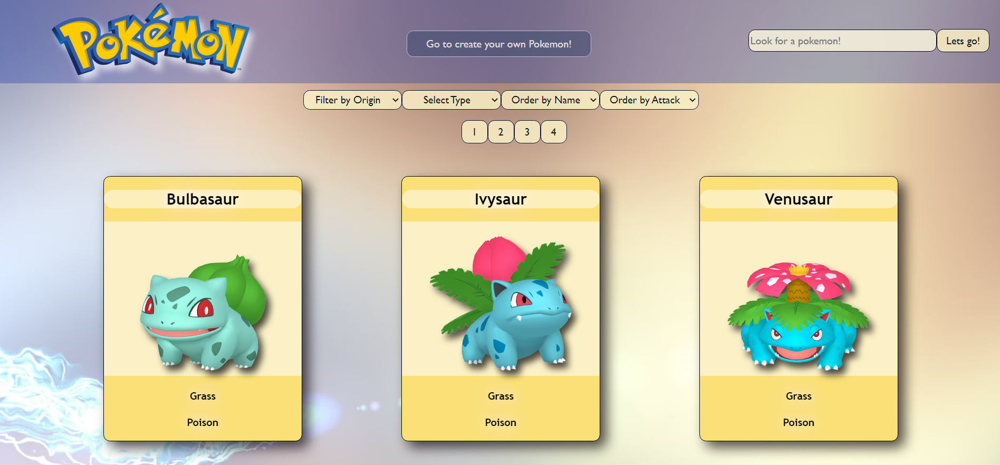
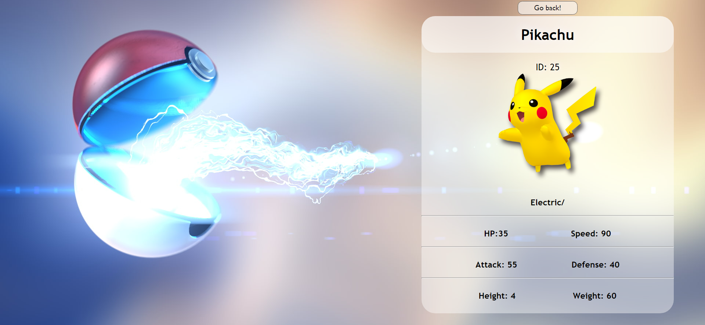
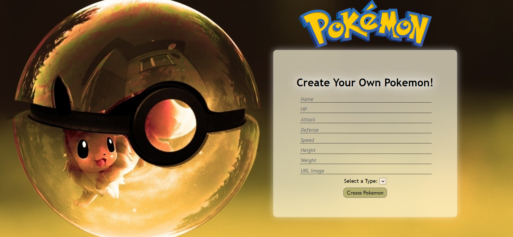

<h1 align="center">Hello! I am Ornella 👋</h1>
<h3 align="center">Full Stack Web Developer 👩🏻‍💻</h3>

I am a 27 years old young woman from Argentina who loves challenges. I have done an intensive Full Stack Development Bootcamp focused on Javascript technologies where I was involved in the development of different apps. I always want to learn new skills and technologies to exploit them. 
 
Thanks for visiting my profile! Have a nice day! 😊

## :bulb: Languages and Tools

<h4 align="center">JavaScript | React | Redux | NodeJS | ExpressJS | Sequelize | PostgreSQL | HTML | CSS | Others</h4>

 

 
 
 
 
 
 
 
 

## :bulb: My Projects

<h3 align="left">Pokemon App</h3>

- Development of a Single Page Application using React for the Front End and Redux as state management. 
- All the components were developed with CSS without the use of external libraries.
- Some features of the project: search bar, orders and filters, controlled form for creation of pokemons.
- The SPA consumes data from an API (https://pokeapi.co/) through a Back End developed in Node.JS using Express.

 

## :round_pushpin: How to Contact me

<a href="https://www.linkedin.com/in/ornella-irigo/" > &nbsp;
<a href="mailto:ornella.irigo@gmail.com" >

