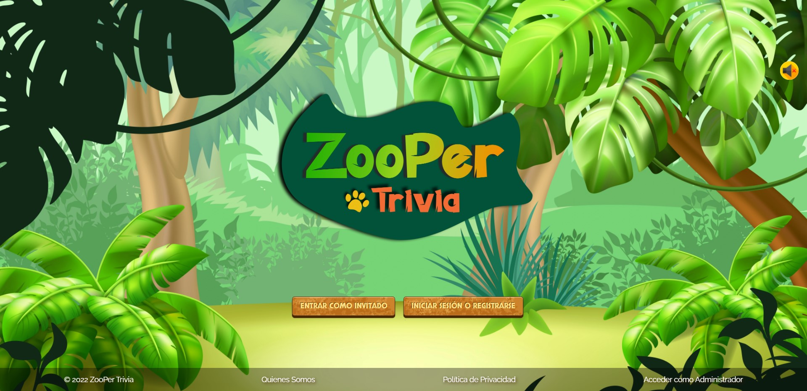

<h1 align="center">Hi! I'm Ornella 👋</h1>
<h3 align="center">Full Stack Web Developer 👩🏻‍💻</h3>

I am a 27 years old young woman from Argentina. I have done an intensive Full Stack Development Bootcamp focused on Javascript technologies where I was involved in the development of different apps. I always want to learn new skills and technologies to exploit them and I am determined to grow in the IT industry!

:nerd_face: I’m currently learning **TypeScript and Socket.io**

:star_struck: I’m looking to collaborate on **any kind of original projects to gain experience**

:blush: Thanks for visiting my profile! **Have a nice day!**

## :bulb: Languages and Tools

<h4 align="left">JavaScript | React | Redux | Bootstrap | NodeJS | ExpressJS | Sequelize | PostgreSQL | HTML | CSS | Firebase | Postman | Git | Heroku</h4>

 

 
 
 
 
 
 
 
 
 
 
 
 
 

## :bulb: My Projects

<h3 align="left">Pokemon App</h3>

- Development of a Single Page Application using React for the Front End and Redux as state management. 
- All the components were developed with CSS without the use of external libraries.
- Some features of the project: search bar, orders and filters, controlled form for creation of pokemons.
- The SPA consumes data from an API (https://pokeapi.co/) through a Back End developed in Node.JS using Express.

<h3 align="left">ZooPer Trivia App</h3>

- Online multiplayer trivia game.
- Use of Scrum methodology.
- Some features of the project: customize the profile, create new questions, buy gold coins to spend on powers, set up the game.
- The app is completely built with JavaScript. 

## :round_pushpin: How to Contact me

<a href="https://www.linkedin.com/in/ornella-irigo/" > &nbsp;
<a href="mailto:ornella.irigo@gmail.com" >

